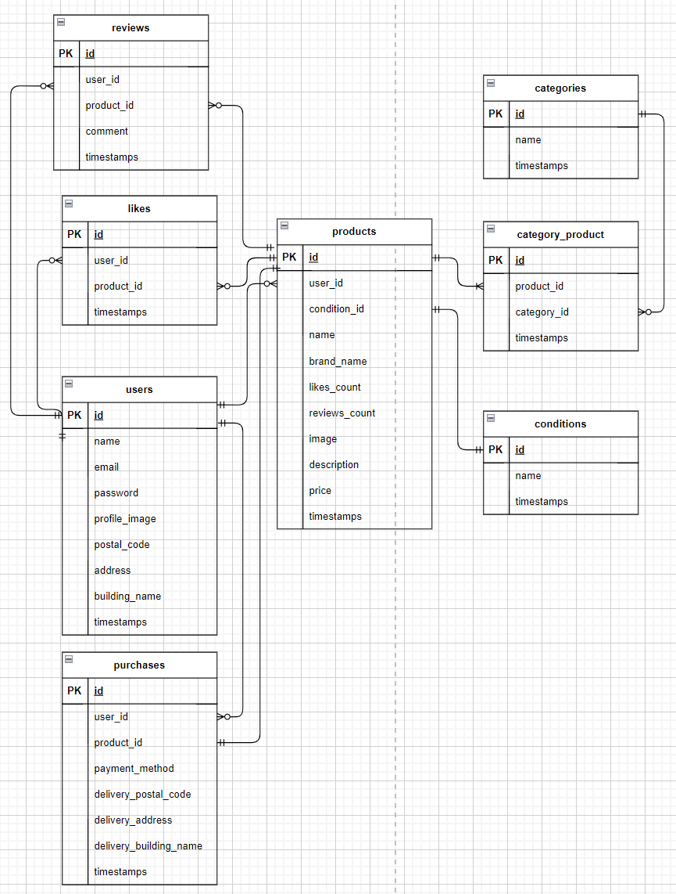

# free-market__myself

## 環境構築
### Dockerビルド
1. git clone git@github.com:akanainoue/free-market__myself.git
2. docker-compose up -d --build

### Laravel環境構築
1. docker-compose exec php bash
2. composer install
3. cp .env.example .env  
4. .envに以下の環境変数を追加  
    Stripe公式サイトで無料アカウントを作成  
    STRIPE_KEY=your_stripe_key  
    STRIPE_SECRET=your_stripe_secret  

5. アプリケーションキーの作成
    php artisan key:generate

6. マイグレーションの実行
    php artisan migrate  

7. シーディングの実行
    php artisan db:seed  

8. シンボリックリンク作成
    php artisan storage:link

9. http://localhost/register で会員登録  
    http://localhost/login でログイン

## ユーザーデータ
  name: ユーザーA  
  email: usera@example.com  
  password: password
  ---
  name:ユーザーB  
  email: userb@example.com  
  password: password
  ---
 name:　ユーザーC  
 email: userc@example.com  
 password: password  
 ---
### 使用技術
+ PHP8.3.0
+ Laravel8.83.27
+ MySQL8.0.26
+ Stripe を使って決済処理を実装
+ Laravel のメール通知（ユーザー認証・通知）に MailHog を使用

## ER図

## URL
+ 開発環境：http://localhost/
+ phpMyAdmin:：http://localhost:8080/
+ Mailhog: http://localhost:8025
